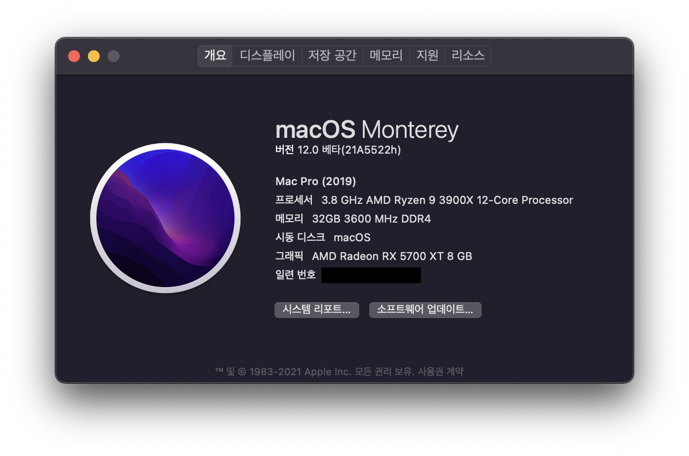

# Ryzen Hackintosh EFI

## What is this

This repository contains the EFI directory for Ryzen 3900X and Gigabyte X570 Aorus Elite combo, with somewhat diverse additional components.

## Specification of my computer

| Component    | Product Name                                     | Note                                           |
|--------------|--------------------------------------------------|------------------------------------------------|
| CPU          | AMD Ryzen 9 3900X                                | PBO enabled                                    |
| Mainboard    | Gigabyte X570 Aorus Elite                        | F35 BIOS                                       |
| Memory       | Samsung DDR4 2666MHz 16GB 2EA                    | Overclocked at 3600MHz with 18-22-22-44 timing |
| Graphics     | XFX AMD Radeon RX 5700 XT 8GB GDDR6 RAW II Ultra | Changed its thermal pad and thermal paste      |
| NVMe 1       | WD Black SN750 500GB                             | macOS 12.0 beta installed                    |
| NVMe 2       | RevuAhn NX2300 1TB (using PCIe to NVMe adapter)  | Manjaro KDE installed                          |
| SSD 1        | Sandisk Ultra 3D 1TB                             | Windows 11 installed                           |
| SSD 2        | ADATA SP920 256GB                                | Miscellaneous storage                          |
| PCI Ethernet | EFM ipTIME PX2500 2.5 GbE LAN Card (RTL8125B)    | Using this as the main Ethernet device         |
| BT/WIFI      | Fenvi T919 (BCM94360CD)                          |                                                |
| PSU          | Antec EAG PRO 750W 80PLUS GOLD Modular           |                                                |
| CPU Paste    | Thermal Grizzly Kryonaut                         |                                                |
| CPU Cooler   | Thermalright Le GRAND MACHO RT                   |                                                |
| MEM Cooler   | BRAVOTEC JONSBO NC-1 Black RGB                   |                                                |
| Case         | 3RSYS L530                                       |                                                |
| USB DAC      | Audinst HUD-DX1 Blue24                           |                                                |

## EFI structure

### WARNING

- This EFI contains additional kexts and PCI informations in **config.plist** rather than the essential things for X570 + Zen2 CPU. You should remove them to apply this to your PC. I recommend you use this as only a reference resource. You should make your own config.plist file for your PC.
- **I'm not responsible for any damage to your device with this EFI. Process at your own risk!**

### One more, check this before you use

In the [config.plist](EFI/OC/config.plist) file, I've replaced the private serial codes into the `EDIT_HERE` words because to keep into be safe my personal information.

So if you are going to use this, you have to make sure that the `EDIT_HERE` text must be changed to yours. To generate the serial key, please refer to the [Dortania's OpenCore Guide](https://dortania.github.io/OpenCore-Install-Guide/AMD/zen.html#platforminfo). When you about to generate one, you should select **MacPro7,1** to proper use your machine.

> - If you are going to convert SMBIOS from **iMacPro1,1** to **MacPro7,1**, make sure that you must logout Apple ID from your current system and regenerate all the SMBIOS details such as MLB, serial number, UUID for MacPro7,1.
> - If your CPU has less than 8 cores, go to `config.plist` file and find "PlatformInfo->Generic" and change the "ProcessorType" from 0 to 1537.

### You got another one you must check

From the recent AMD CPU patch, now we have to specify the CPU core counts to the `algrey - Force cpuid_cores_per_package` nodes. Currently, my EFI setup sets that for the **12-core** CPU model since I'm using Ryzen 3900X.

- `algrey - Force cpuid_cores_per_package`
  - 10.13,10.14
    - B8**0C**0000 0000
  - 10.15,11.0
    - BA**0C**0000 0000
  - 12.0
    - BA**0C**0000 0090

Please refer to [the author's description](https://github.com/AMD-OSX/AMD_Vanilla#read-me-first) to get further information.

### OpenCore

- Version: 0.7.5

### ACPI

- SSDT-HPET.aml
- SSDT-NVME.aml
- SSDT-PLUG.aml
- SSDT-SBRG.aml
- SSDT-SBUS-MCHC.aml
- SSDT-EC-USBX-DESKTOP.aml
- SSDT-XHC.aml

### Drivers

- OpenCanopy.efi
- OpenHfsPlus.efi
- OpenRuntime.efi

### Kexts

- AGPMInjector.kext
- AMDRyzenCPUPowerManagement.kext
- AppleALC.kext
- AppleMCEReporterDisabler.kext
- CtlnaAHCIPort.kext
- Lilu.kext
- LucyRTL8125Ethernet.kext
- NVMeFix.kext
- RestrictEvents.kext
- SmallTreeIntel82576.kext
- SMCAMDProcessor.kext
- VirtualSMC.kext
- WhateverGreen.kext

### Tools

- OpenShell.efi

## What works and what doesn't work

### Works

- Almost everything including Apple continuity (Handoff, iMessage, Airdrop, Facetime, ...).

### Partially works

- Analog audio including speakers and microphone. But USB Speaker (USB-DAC) and USB microphone is working.
- Specific professional applications may need to be patched for AMD processor such as Adobe apps, Davinci Resolve, etc.
- Virtualization (Apple Hypervisor and the apps using this like AVD on Android Studio, Parallels) is not working but VirtualBox works.

### Doesn't work

- Sidecar
- Probably there's something that I couldn't find yet (I am a software engineer :smiley:). For further information that the common limits of the AMD Hackintosh systems, please refer to the [CPU support part of the Dortania's OpenCore Guide](https://dortania.github.io/OpenCore-Install-Guide/macos-limits.html#cpu-support).

## References

- <https://dortania.github.io/OpenCore-Install-Guide/>
- <https://forum.amd-osx.com/index.php?threads/ms-x570-aorus-elite-5700-xt-r7-3800x-big-sur-oc-0-6-6.1524/>
- <https://forum.amd-osx.com/index.php?threads/audiogods-gigabyte-aorus-x570-pro-pro-wifi-ultra-master-big-sur-monterey-beta-opencore-0-7-3-efi.1344/>
